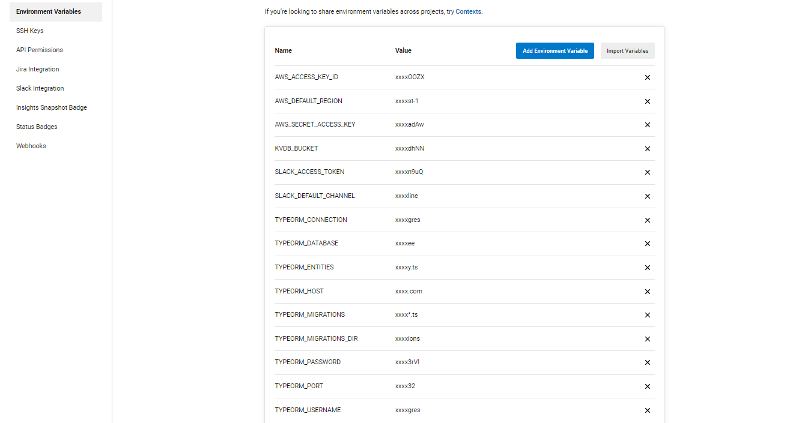
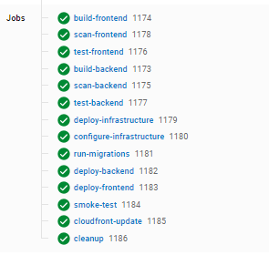

## Give your Application Auto-Deploy Superpowers

In this project, you will prove your mastery of the following learning objectives:

- Explain the fundamentals and benefits of CI/CD to achieve, build, and deploy automation for cloud-based software products.
- Utilize Deployment Strategies to design and build CI/CD pipelines that support Continuous Delivery processes.
- Utilize a configuration management tool to accomplish deployment to cloud-based servers.
- Surface critical server errors for diagnosis using centralized structured logging.

### Project Submission Requirements

For your submission, please submit the following:

- A text file named `urls.txt` including:
  1. Public Url to GitHub repository (not private) [URL01]
  1. Public URL for your S3 Bucket (aka, your green candidate front-end) [URL02]
  1. Public URL for your CloudFront distribution (aka, your blue production front-end) [URL03]
  1. Public URLs to deployed application back-end in EC2 [URL04]
  1. Public URL to your Prometheus Server [URL05]
- Your screenshots in JPG or PNG format, named using the screenshot number listed in the instructions. These screenshots should be included in your code repository in the root folder.
  1. Job failed because of compile errors. [SCREENSHOT01]
  1. Job failed because of unit tests. [SCREENSHOT02]
  1. Job that failed because of vulnerable packages. [SCREENSHOT03]
  1. An alert from one of your failed builds. [SCREENSHOT04]
  1. Appropriate job failure for infrastructure creation. [SCREENSHOT05]
  1. Appropriate job failure for the smoke test job. [SCREENSHOT06]
  1. Successful rollback after a failed smoke test. [SCREENSHOT07]  
  1. Successful promotion job. [SCREENSHOT08]
  1. Successful cleanup job. [SCREENSHOT09]
  1. Only deploy on pushed to `master` branch. [SCREENSHOT10]
  1. Provide a screenshot of a graph of your EC2 instance including available memory, available disk space, and CPU usage. [SCREENSHOT11]
  1. Provide a screenshot of an alert that was sent by Prometheus. [SCREENSHOT12]

- Your presentation should be in PDF format named "presentation.pdf" and should be included in your code repository root folder. 

Before you submit your project, please check your work against the project rubric. If you haven’t satisfied each criterion in the rubric, then revise your work so that you have met all the requirements. 

## A complete CI/CD project
This project is a part of the Udacity Cloud DevOps nanodegree and executes the following:

- Sets up a complete blue deployment with infrastructure including:
  - Static website deployed in an S3 bucket
  - Cloudfront pointing to the static website
- Creates a green deployment with the following infrastructure:
  - S3 website frontend
  - EC2 backend with NodeJS
  - Postgres Database
- Integration tests with:
  - Slack integration
  - Frontend and backend smoke testing
- Sets up centralised structured logging and diagnosis with:
  - Prometheus for monitoring
  - Gmail for automated notifications

Blue-green deployment happens after all tests are complete

## Instructions

- Fork this repository and clone into your local device
- Connect the repo to your CircleCI account
- Create environment variables in CircleCI for 
  ### AWS
  - AWS_ACCESS_KEY_ID: Your AWS access key ID
  - AWS_DEFAULT_REGION: Your default AWS region
  - AWS_SECRET_ACCESS_KEY: Your AWS secret key
  ### Gmail (create an application password at https://support.google.com/accounts/answer/185833?hl=en)
  - AuthEmail: Authentication email
  - EmailPassword: app password
  - FromEmail: Email to send Prometheus notifications from
  - ToEmail: The email to receive the notifications
  ### Slack (create a slack app and fill in the following required items to auto-notify your channel on failure)
  - SLACK_ACCESS_TOKEN
  - SLACK_DEFAULT_CHANNEL
  ### Database parameters for postgres DB
  A sample file is in ./backend/development.env. The only parameter you need to change here is TYPEORM_PASSWORD
  - TYPEORM_CONNECTION=postgres
  - TYPEORM_DATABASE=postgres
  - TYPEORM_ENTITIES=./src/modules/domain/**/*.entity.ts
  - TYPEORM_MIGRATIONS=./src/migrations/*.ts
  - TYPEORM_MIGRATIONS_DIR=./src/migrations
  - TYPEORM_USERNAME=postgres
  - TYPEORM_PORT=5432
  - TYPEORM_PASSWORD: any password of your choice  
  

### Built With 💓

- [Circle CI](www.circleci.com) - Cloud-based CI/CD service
- [Amazon AWS](https://aws.amazon.com/) - Cloud services
- [AWS CLI](https://aws.amazon.com/cli/) - Command-line tool for AWS
- [CloudFormation](https://aws.amazon.com/cloudformation/) - Infrastructure as code
- [Ansible](https://www.ansible.com/) - Configuration management tool
- [Prometheus](https://prometheus.io/) - Monitoring tool
- [Gmail](https://gmail.com) - Monitoring notifications
- [Slack](https://api.slack.com) - build notifications

### License

[License](LICENSE.md)

### Circleci

